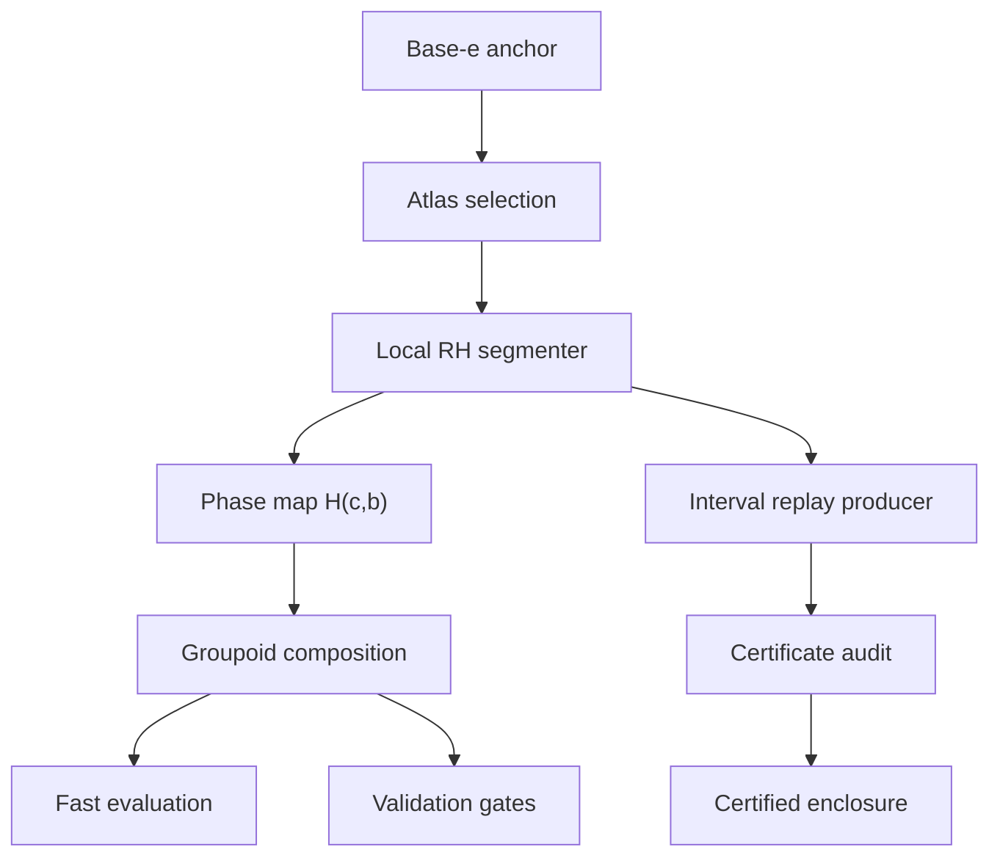

# Paper VI – Implementationsspezifikation für die Basenrekonstruktion

Stand: 29. Juli 2026

Serie: Tetration Base Change, Teil VI

Zielrepository: `gp-tetration`

## 0. Verbindlicher Review-Abgleich

Diese Fassung übernimmt das Nachreview „Paper VI – Was noch fehlt“ als
Abnahmeliste. Ein Punkt gilt nur dann als geschlossen, wenn der angegebene
maschinenprüfbare Gegenstand vorliegt; eine Formel, ein Schemafeld oder ein
Float-Test ersetzt keine Intervallrechnung.

| Review-Punkt | Status dieser Fassung | Erforderlicher Abschlussnachweis |
|---|---|---|
| vollständige Intervall-RH-Daten | für `8r1` umgesetzt, global offen | dieselbe outward-rounded QH-, Koenigs-, Quotienten-, Trace-, Fourier-/Chebyshev-, Hardy-, Tail-, Cut- und Lipschitzpipeline auf allen Segmenten |
| echtes Segmentzertifikat, zuerst `8r1` | **erfüllt** | unabhängiger Replay: \(q<1\), \(p_{8r1}(r)<0\), Z1–Z7 positiv |
| alle Marschsegmente | offen, nach `8r1` | negative Polynome, vollständige Endpunktkugel-Inklusionen und Grönwall-Summe aus den echten Radien |
| segmentuniformes End-Gluing | analytischer Vertrag vorhanden, Zahlen offen | Basisboxen des ganzen Marsches mit \(\sup|\vartheta_\beta'|<1\), beiden Endgrenzwerten und Overlap-Replay |
| Schnittebenenfortsetzung | analytischer Vertrag vorhanden, Templates offen | rekursive Intervalltemplates samt Cut-, Overlap-, Induktions- und Monodromiechecks |
| statische Kneser-Eindeutigkeit | Formulierung korrigiert, numerische Voraussetzungen offen | Paulsen–Cowgill Prop. 2 auf \(\Re z>-2\) mit oberem **und** unterem Fixpunktgrenzwert; danach Identitätssatz auf \(\mathbb C\setminus(-\infty,-2]\) |
| Gesamtzertifikat | lokaler 8r1-Replay vorhanden, globale Kette offen | hashgebundene Arrays und unabhängige Neuauswertung aller Segmente plus Gluing |
| Rechner | Controller, 8r1-Produzenten und unabhängiger Replay vorhanden | Verallgemeinerung der numerischen Kerne auf beliebige kurze Segmente |

Der zuvor festgelegte erste Meilenstein ist jetzt erfüllt:

\[
\boxed{\texttt{8r1}: \quad
Y,\ L,\ q,\ r\ \text{werden aus Intervallarrays reproduziert und }
Y+(q-1)r<0.}
\]

Die im Forschungslog erwähnten Dateien `save_traj_8r1.py` und
`trajectory_8r1.json` befinden sich weder im Zielrepository noch in den
dieser Revision übergebenen Anlagen. Deshalb wurde das exakte Segment neu
gerechnet. Die reproduzierte Bahn und der Replay ergeben:

| Größe | outward-rounded Intervall |
|---|---|
| \(Y\) | \([2.89398623506807\cdot10^{-10}\pm8.15\cdot10^{-25}]\) |
| \(L\) | \([13613.30588130968\pm8.70\cdot10^{-12}]\) |
| \(q\) | \([0.1495393411962912\pm9.19\cdot10^{-17}]\) |
| \(r\) | \([4.2535568887144\cdot10^{-10}\pm3.01\cdot10^{-24}]\) |
| \(p(r)\) | \([-7.234965587670\cdot10^{-11}\pm2.51\cdot10^{-24}]\) |

Alle Z1–Z7-Ränder sind positiv. Die uniforme Beweisunterteilung umfasst
\(262144\) mathematische Mikrosegmente; sie ist eine Folge des absichtlich
groben Full-Ball-Lipschitzmajoranten, nicht der Fließkommaauflösung.

## 1. Zweck und belastbarer Status

Diese Spezifikation beschreibt die produktionsfähige Umsetzung der
anchor-pure Basenrekonstruktion aus Paper VI. Sie trennt drei Aussagen:

| Modus | Aussage | Darf Zielbasen-Engine verwenden? | Ergebnis |
|---|---|---:|---|
| Fast | schnelle numerische Näherung mit interner Prognose | nein, nicht zur Laufzeit; historische Atlaswerte sind sichtbar markiert | Mittelpunkt und Prognose |
| Validated | mehrere unabhängige numerische Konsistenzprüfungen | nein | Mittelpunkt und nicht-rigoroses Fehlerbudget |
| Certified | computerassistierter Beweis gemäß Master-Theorem | nein | Mittelpunkt und nach außen gerundeter Radius |

Die Tabelle beschreibt den Garantievertrag. Der lokale Segment-Replay kann
`8r1` jetzt zertifizieren. Die öffentliche Rechnerzeile `Certified` bleibt
dennoch absichtlich unerreichbar, bis die vollständige Ankerkette,
Endpunktinklusionen, End-Gluing- und Cut-Plane-Bundles vorliegen.

Im Repository sind bereits implementiert:

- `src/fatou_backend/reconstruction.py`: Modussteuerung,
  Atlas-Selektion, Phasenabbildung, Komposition, Fast-Prognose,
  Validierungs-Gates und CLI;
- `src/fatou_backend/certification.py`: strukturelles und skalares
  Precertificate-Audit für `ovsyannikov-contraction-v1`; das globale
  Array-Ketten-Gate bleibt absichtlich fail-closed, bis alle Segmente
  eingebunden sind;
- `research/certificates/paper_vi_certificate_template.json`:
  Schema-v2-Vorlage;
- `research/certification8r1/produce_8r1.py` und
  `save_traj_8r1.py`: reproduzierbarer siebenknotiger Kandidatenproduzent;
- `research/certification8r1/certify_8r1.py` und
  `certify_hilbert_8r1.py`: outward-rounded Arb-Produzenten für
  Koenigs-, Quotienten-, Tail- und graded-Hilbert-Arrays;
- `research/certification8r1/replay_8r1.py`: getrennte Array-Neuauswertung
  von RH, Volterraresiduum, \(L,q,r,p(r)\), Transfers und Z1–Z7;
- `tests/test_reconstruction_modes.py`: reine Python-Tests für Atlas,
  Komposition, Radii-Polynom, Endpunktgewicht, die korrigierten
  Eindeutigkeitsbedingungen, Hash-Integrität und Fail-closed-Verhalten.

Noch nicht implementiert sind:

1. der schwebend gerechnete lokale RH-Marsch für eine nicht gespeicherte
   Zielbasis;
2. die Verallgemeinerung des 8r1-Intervallproduzenten und -Replays auf
   alle Marschsegmente;
3. die tatsächlichen Intervallzertifikate und Handoffs für alle Segmente;
4. die uniformen Intervallboxen für End-Gluing und Schnittebenenfortsetzung.

Die dem Projekt beiliegenden Texte berichten eine zehnsegmentige Kandidatenbahn,
enthalten aber nicht deren vollständige Lobatto-Zustände, RH-Moden und
Intervallarrays. Deshalb dürfen keine numerischen Radii-Polynome für diese
Segmente aus den gerundeten Tabellen rekonstruiert oder erfunden werden.

## 2. Nicht verhandelbare Invarianten

### 2.1 Anchor-pure Provenienz

Der Beweispfad startet bei \(T_e\). Für eine Zielbasis \(b\) dürfen weder
`FatouGP.sexp(b, ...)` noch `FatouGP.slog(b, ...)` zur Initialisierung,
Korrektur oder Zertifizierung verwendet werden.

Der neue `8r1`-Datensatz markiert deshalb ausdrücklich
`candidate_target_engine_used=true`: Die Zielbasis-Engine erzeugte hier nur
ein beliebiges gutes Zentrum und den blinden Stencilvergleich. Der
a-posteriori Array-Replay verwendet diese Engine nicht und zertifiziert die
lokale Lösungskugel, aber dieser isolierte Test erfüllt noch **nicht** die
anchor-pure Elternkette. Vor Aufnahme in das globale Zertifikat muss dasselbe
Zentrum aus der zertifizierten Eingangskugel des vorangehenden Segments
reproduziert oder von ihr strikt eingeschlossen werden.

Die vorhandenen Einträge für Basis 2 und 3 in `phi_modes.json` wurden
historisch über Zielbasiswerte erzeugt. Sie bleiben für Fast-Betrieb nutzbar,
werden aber als `anchor_pure=false` behandelt. Certified Mode filtert sie aus.

Jeder neue Atlasanker speichert:

- Ausgangsanker und vollständige Elternkette;
- Basisintervall und verwendete Segment-IDs;
- Hashes aller Zustände und Zertifikate;
- Modus, Präzision, Codeversion und Intervallbackend;
- `target_engine_data_used=false`.

### 2.2 Fail closed

- Fast darf eine Warnung und eine schlechte Prognose zurückgeben.
- Validated muss bei einem fehlenden Gate abbrechen.
- Certified muss bei einem fehlenden Feld, nicht-strikten Rand, unbekannten
  Beweisprofil, Hashfehler oder nicht abgedeckter Auswertung abbrechen.
- Ein fehlender lokaler Marcher darf niemals durch den Aufbau einer
  Zielbasen-Engine ersetzt werden.

### 2.3 Typen

Die nichtperiodische Tetration \(T\) lebt auf einem komplexen
Fundamentalgebiet. Nur folgende Objekte werden als periodische
Fourierreihen gespeichert:

- die Grad-eins-Korrektur \(p=U-\mathrm{id}\);
- der normalisierte Anteil \(h=p-q_\beta\);
- das periodische Antwortfeld \(G\);
- die homogene RH-Korrektur.

Eine Implementierung, die \(T\) selbst modulo 1 faltet, ist falsch.

## 3. Mathematische Datenflüsse

Für

\[
\beta=\log\log b,\qquad b_\beta=\exp(e^\beta)
\]

wird auf jedem re-anchorten Segment ein Rohzweig \(Q_\beta\) erzeugt und

\[
T_{\beta,h}=Q_\beta\circ U_{\beta,h},\qquad
U_{\beta,h}(x)=x+q_\beta+h(x),\qquad h(0)=0
\]

gesetzt.

Der RH-Schritt ist:

1. \(T=Q\circ U\) und \(T'\) auf dem komplexen Überlappungsgebiet bilden.
2. Obere und untere Koenigs-Daten \(\Gamma^\pm\) auswerten.
3. Geometrische Felder
   \[
   v_{\mathrm{geo}}^\pm=\Gamma^\pm(T)/T'
   \]
   bilden; Division nur nach Nullstellenausschluss für \(T'\).
4. Periodische Spur
   \[
   u=(v_{\mathrm{geo}}^+-v_{\mathrm{geo}}^-)/(2i)
   \]
   erzeugen.
5. Hardy-Projektion \(\mathcal C_+u\) auf dem Fourierkopf ausführen und den
   analytischen Rest separat fortpflanzen.
6. Mit
   \[
   c=-(v_{\mathrm{geo}}^++\mathcal C_+u)(0)
   \]
   normieren.
7. \(\mathcal R^h=v_{\mathrm{geo}}^++\mathcal C_+u+c\) bilden.
8. Komplexen Schwanz
   \[
   S(x)=\sum_{j\ge0}\frac{T(x+j)}{T'(x+j)}
   \]
   mit endlichem Kopf und analytischem Rest berechnen.
9. Das periodische Feld \(G=\mathcal R^h-S\) bilden.
10. Den Hub integrieren:
    \[
    \partial_\beta p=-(1+p')G,\qquad
    \partial_\beta h=-(1+h')G-q_\beta'.
    \]

## 4. Architektur



Die Komponenten müssen getrennt bleiben:

- **Numerischer Produzent:** erzeugt Kandidaten und Diagnostik.
- **Intervallproduzent:** erzeugt nach außen gerundete Enclosures.
- **Auditor:** rechnet die skalaren Beweisungleichungen neu und prüft
  Integrität und Vollständigkeit.
- **Evaluator:** konsumiert nur freigegebene Phasenabbildungen.

## 5. Repräsentationen

### 5.1 Phasenabbildung

`PhaseMap` speichert

\[
H_{c,b}(x)=x+\mu+\sum_{k=1}^K
\operatorname{Re}(a_ke^{2\pi ikx}).
\]

Die Koeffizienten in `modes[k-1]` sind die real-symmetrische
Einseitenrepräsentation \(a_k\). Die Komposition lautet

\[
H_{e,b}=H_{e,c}\circ H_{c,b},
\]

also für die periodischen Korrekturen

\[
p_{e,b}(x)=p_{c,b}(x)+p_{e,c}(x+p_{c,b}(x)).
\]

Nach jeder Komposition sind Neutralmode, Orientierung
\(\inf(1+p')>0\), Aliasing und abgeschnittener Schwanz zu prüfen.

### 5.2 Lokaler Pfad

Empfohlene Gitter:

- Fouriermoden in der periodischen Variablen \(x\);
- Chebyshev-Lobatto-Knoten in der lokalen Basiszeit \(t\);
- Chebyshev- oder Bernsteinmodelle auf nichtperiodischen komplexen
  Fundamentalgebieten;
- getrennte analytische Restschranken, niemals „Rest = letzter Koeffizient“.

Ein Segmentdatensatz enthält mindestens:

```text
beta_a, beta_b
rho0, kappa, rho_end
fourier_order, lobatto_order, working_dps
candidate coefficients at all Lobatto nodes
RH head and tail diagnostics
Volterra residual head and tail
admissibility margins
endpoint state and endpoint error
provenance hashes
```

### 5.3 Intervallformat

Intervallarrays werden binär gespeichert, nicht als gerundete
Dezimal-Mittelpunkte in JSON. JSON enthält nur:

- sichere relative Pfade;
- SHA-256;
- nach außen gerundete skalare Ober- oder Untergrenzen;
- Form, Ordnung, Backend und Rundungsmodus;
- logische Abhängigkeiten.

Geeignete Backends sind Arb über `python-flint` oder eine äquivalente
gerichtet gerundete Bibliothek. Das Backend muss komplexe Kugeln,
Polynom-/Chebyshev-Auswertung, Exponentialfunktion, Logarithmus,
Ableitungen und Matrix-/FFT-Fehler kontrollieren.

## 6. Atlas-Selektion

### 6.1 Fast und Validated

1. Zielbasis prüfen: \(b>e^{1/e}\).
2. \(\beta_d=\log\log b\) berechnen.
3. Nur Atlasanker mit kompatiblem Zweig, Streifen und Präzisionsbudget
   betrachten.
4. Kostenfunktion verwenden:
   \[
   \mathrm{cost}(c)=
   w_\beta|\beta_d-\beta_c|
   +w_E E_{\mathrm{atlas}}
   +w_K K_{\mathrm{erwartet}}.
   \]
5. Exakten Atlas-Treffer direkt verwenden oder kurzen lokalen Marsch starten.
6. Ist der prognostizierte Schritt außerhalb der Ovsyannikov-Bandbreite,
   vor dem Rechnen teilen.

Die bisherige `nearest()`-Methode verwendet nur den \(\beta\)-Abstand. Der
Produktionscode soll die obige Kostenfunktion ergänzen.

### 6.2 Certified

Es sind ausschließlich folgende Anker zulässig:

- die exakte Identität bei \(e\);
- ein bereits akzeptierter anchor-pure Anker mit vollständiger
  Zertifikatskette.

Der Zertifikatsgraph muss bis \(e\) zurückverfolgbar sein. Ein Hash ohne
Provenienzgraph genügt nicht.

## 7. Fast Mode

Ziel: normale Rechnernutzung bei typischerweise 10–15 belastbaren
Dezimalstellen.

### 7.1 Algorithmus

1. Intern mindestens `requested_digits + 30` Dezimalstellen verwenden.
2. Nächsten zulässigen Atlasanker wählen.
3. Lokalen Schritt adaptiv vorschlagen.
4. Schwebend gerechneten RH-Kopf und modellierten Schwanz bilden.
5. Hubpfad per Picard-Chebyshev oder charakteristischer Form integrieren.
6. Phasenabbildungen komponieren.
7. Anfragewerte über den Base-e-Anker auswerten.
8. Fehlerprognose ausgeben.

### 7.2 Fehlerprognose

Die Prognose soll mindestens enthalten:

\[
E_{\rm pred}=s\left(
E_{\rm tail}+E_{\rm resolution}+E_{\rm lift}
+E_{\rm norm}+E_{\rm FE}+E_{\rm roundtrip}
+E_{\rm split}+\frac{R_{\rm Volterra}}{1-q_{\rm est}}
\right),
\]

mit Sicherheitsfaktor \(s\), standardmäßig 3. Ist \(q_{\rm est}\ge1\), ist
die Prognose unendlich und das Segment muss geteilt werden.

Fast Mode darf ein Ergebnis trotz schlechter Prognose liefern, muss den
Status aber sichtbar machen.

## 8. Validated Mode

Validated Mode benutzt denselben Mittelpunkt wie Fast Mode, fordert aber
unabhängige Rechnungen.

### 8.1 Pflicht-Gates

| Gate | Durchführung | Akzeptanz |
|---|---|---|
| Auflösungssteigerung | komplette Rechnung mit \((N,K)\) und \((2N,2K)\) | Differenz im Budget |
| Pfad-Splitting | direktes Segment gegen zwei Halbsegmente | Differenz im gemeinsamen Budget |
| Lift-Tiefe | mindestens zwei unabhängige `n_lift` | Differenz im Budget |
| Normierung | \(T(0)=1\), \(T(1)=b\), \(h(0)=0\) | je unter Toleranz |
| Funktionalgleichung | Off-grid \(T(x+1)-b^{T(x)}\) | unter Toleranz |
| Roundtrip | `slog(sexp(x))-x` und `sexp(slog(y))-y` | unter Toleranz |
| Residuum→Fehler | \(R/(1-q_{\rm est})\) | endlich und im Budget |
| Orientierung | \(\min(1+p')\) auf dichterem Gitter plus Tailbuffer | strikt positiv |

Die zweite Auflösung muss wirklich neu rechnen. Nur vier Fouriermoden aus
derselben fertigen Reihe wegzulassen ist ein Fast-Prädiktor, keine
unabhängige Auflösungssteigerung.

### 8.2 Akzeptanz

Alle Pflicht-Gates müssen vorhanden sein. Die Summe mit Sicherheitsfaktor
muss kleiner als \(10^{-d}\) für die angeforderten \(d\) Stellen sein.
Validated Mode darf das Wort „Beweis“ nicht verwenden.

## 9. Certified Mode

Certified Mode besteht aus vier getrennten Zertifizierungsblöcken.

### 9.1 Vollständiger Intervall-RH-Operator

Für jedes Basisintervall und die ganze Kandidatenkugel sind zu zertifizieren:

1. Intervallmodelle für \(Q,Q',T,T'\);
2. Bilder, Schnittabstände und Nullstellenausschluss;
3. Fixpunkte, Multiplikatoren und \(\Gamma^\pm,(\Gamma^\pm)'\);
4. gemeinsame obere/untere Überlappung;
5. Quotienten \(v_{\rm geo}^\pm\);
6. periodische Spur mit validierter Fourierkonversion;
7. exakte Hardy-Multiplikatoren auf dem Kopf;
8. analytischer Projektionsrest;
9. Normierung bei \(x=0\);
10. RH-Norm und Lipschitzschranke;
11. komplexer Schwanz \(S\) und dessen Lipschitzschranke.

Jede Division benötigt eine zuvor geprüfte Nullferne. Jeder Logarithmus
benötigt eine zuvor geprüfte Schnittferne.

### 9.2 Lineares Radii-Polynom

Für Segment \(j\):

\[
q_j=\frac{4\sqrt2\,\overline L_j}{\kappa_j}<1,
\qquad
Y_j=Y_{j,\mathrm{head}}+Y_{j,\mathrm{tail}},
\]

\[
p_j(r_j)=Y_j+(q_j-1)r_j<0.
\]

Der Auditor rechnet diese Größen aus den deklarierten Ober-/Untergrenzen
neu. Das quadratische Newton-Polynom ist in diesem Beweisprofil verboten,
weil die benötigte Lipschitzschranke für \(D\mathscr F\) im selben
gewichteten Pfadraum nicht aus dem einfachen Skalenverlust folgt.

### 9.3 Endpunktgewicht und Marsch-Gluing

Aus dem Pfadraumradius folgt auf einem gewählten Endstreifen:

\[
\varepsilon_{{\rm path},j}=
\frac{r_j}{
\sqrt{\rho_{0,j}-\kappa_j a_j-\rho_{{\rm end},j}}
}.
\]

Dieser Faktor darf nicht weggelassen werden. Für die vollständige
Phasenabbildung kommen die Intervallfehler der Roh-Normierung und der
Darstellungsumwandlung hinzu:

\[
\varepsilon_j=
\varepsilon_{{\rm path},j}
+\varepsilon_{q,j}
+\varepsilon_{{\rm repr},j}.
\]

Für jedes nichtletzte Segment
ist die volle Koeffizienten-und-Tail-Kugel in die Startkugel des
Nachfolgesegments einzuschließen:

\[
E_{\rm out}+D_{\rm centers}+m_{\rm strict}
\le R_{\rm next}.
\]

Die globale Schranke ist:

\[
E_{\rm global}\le
\sum_j \varepsilon_j
\prod_{k>j}\exp(M_{1,k}|\Delta\beta_k|).
\]

### 9.4 Beidseitiges End-Gluing und Schnittebene

Auf jeder Basisbox eines Segments sind uniform zu prüfen:

- obere Koenigs-Inverse und exponentielle Konvergenz gegen
  \(L_{1,\beta}\);
- Hardy-Korrektur mit \(\sup|\vartheta'|<1\);
- Bildhalbebene;
- Intervall-Newton-Eindeutigkeit auf allen Überlappungsboxen;
- Kompatibilität benachbarter Basisboxen.

Für reelle Basen erzeugt die zertifizierte Konjugationssymmetrie daraus ein
unteres Modell mit Grenzwert
\(L_{2,\beta}=\overline{L_{1,\beta}}\). Der Replay muss den
Konjugationsschritt, dessen Domänenüberdeckung und die unteren
Overlap-Identitäten ausdrücklich prüfen. Ein nur oberes Modell ist kein
vollständiger Eindeutigkeitsnachweis.

Zusätzlich ist eine endliche rekursive Fortsetzungsstruktur für

\[
\mathbb C_{-2}=\mathbb C\setminus(-\infty,-2]
\]

zu liefern. Sie benötigt:

- endliche Übergangsboxen;
- rechte Funktionalgleichungs-Translationen;
- linke Logarithmusboxen mit Schnittabstand;
- induktive Templates für unbeschränkte Zellen und Annäherung an beide
  Seiten des Schnitts;
- obere und konjugiert untere Endmodelle;
- Identitätsprüfungen auf allen Überlappungen.

Die statische Identifikation erfolgt in zwei getrennten Schritten:

1. **Paulsen–Cowgill, Proposition 2.** Auf der Halbebene
   \(H_{-2}=\{z:\Re z>-2\}\) sind Analytizität, Funktionalgleichung,
   \(F(0)=1\) und für jedes \(x>-2\) beide Grenzwerte
   \[
   F(x+iy)\to L_{1,\beta}\quad(y\to+\infty),\qquad
   F(x+iy)\to L_{2,\beta}\quad(y\to-\infty)
   \]
   nachzuweisen. Damit stimmt der rekonstruierte Zweig auf \(H_{-2}\) mit
   dem Kneser-Zweig überein.
2. **Übergang zur Schnittebene.** Beide Zweige sind holomorph auf der
   zusammenhängenden Menge
   \(\mathbb C_{-2}\). Da sie bereits auf der offenen Teilmenge
   \(H_{-2}\) übereinstimmen, erweitert der Identitätssatz die Gleichheit auf
   die gesamte Schnittebene.

## 10. Zertifikatspaket

Empfohlene Struktur:

```text
paper-vi-cert-b2/
  certificate.json
  data/
    anchor.cheb.arb
    provenance.json
    segment-000-path.arb
    segment-000-rh.arb
    segment-000-end.arb
    ...
    cut-plane-templates.arb
    replay-trace.json
```

`certificate.json` folgt
`research/certificates/paper_vi_certificate_template.json`.

Der bestehende Precertificate-Auditor prüft bereits:

- exaktes Schema und Beweisprofil;
- Konsistenz von `target_beta` mit \(\log\log(\texttt{target_base})\);
- Basisbereich und lückenlose Segmentkette ab \(\beta=0\);
- sichere relative Quelldateien und deren SHA-256;
- gerichtete Rundungsmetadaten;
- Intervall-RH-Komponenten und positive Ränder;
- \(q\), lineares Radii-Polynom und Endpunktgewicht;
- volle Endpunktinklusion;
- segmentuniformes End-Gluing;
- Grönwall-Summe;
- Auswertungsbereich und Auswertungsradius;
- exakter SHA-256-Fingerprint der tatsächlich ausgewerteten Phasenabbildung;
- separates Rundungsbudget der schwebenden Mittelpunkt-Auswertung;
- Schnittebenenfelder;
- die korrigierten Halbebenenbedingungen von Paulsen–Cowgill Proposition 2
  samt getrenntem Identitätssatz-Bridge zur Schnittebene.

Schema v2 enthält zusätzlich ein obligatorisches `array_replay`-Gate. In
dieser Revision ist dessen Status ausschließlich `not-implemented`; der
Auditor setzt den Gesamtstatus daher unabhängig von allen deklarierten
`pass`-Feldern auf **fehlgeschlagen**. Der nächste Implementationsschritt
muss einen unabhängigen Replay-Layer ergänzen, der die RH-Komponenten direkt
aus den binären Intervallarrays neu auswertet. Bis dahin ist der Auditor eine
strenge Integritäts- und Ungleichheitsprüfung, aber weder ein Ersatz für den
Intervallproduzenten noch ein Aussteller eines Beweises.

## 11. Vorgeschlagene Module

```text
src/fatou_backend/
  reconstruction.py          # vorhanden: Steuerung und Evaluation
  certification.py           # vorhanden: Audit
  rh_float.py                 # neu: schwebender RH-Operator
  local_march.py              # neu: adaptiver Segmentmarcher
  reconstruction_cache.py    # neu: atomarer, provenienzgebundener Cache
  interval/
    models.py                 # Intervall-Fourier/Chebyshev-Datentypen
    qh.py                     # QH-Komposition und Margins
    koenigs.py                # Fixpunkt-/Koenigs-Zertifikate
    rh.py                     # vollständiger Intervall-RH
    volterra.py               # Residuum, L, q, p(r), Endpunktfehler
    end_gluing.py             # uniforme Überlappungen
    cut_plane.py              # rekursive Fortsetzung
    producer.py               # Bundle-Erzeugung
    replay.py                 # unabhängige Prüfung aus Arrays
```

Keines dieser Module darf `basechange.phi_modes_cached()` auf einem
fehlenden Zielbasiseintrag aufrufen, da diese Funktion dann historisch eine
Zielbasis-Engine aufbaut.

## 12. Schnittstellen

Der vorhandene Float-Marcher-Vertrag ist:

```python
class LocalRHMarcher(Protocol):
    def march(
        self,
        anchor: AtlasAnchor,
        target_base: mp.mpf,
        digits: int,
    ) -> LocalMarchResult:
        ...
```

`LocalMarchResult` muss liefern:

- relative Phasenabbildung \(H_{c,b}-\mathrm{id}\);
- Volterraresiduum;
- Direct-vs-Split-Differenz;
- unabhängige Auflösungsdifferenz;
- geschätztes \(q_{\rm est}<1\);
- Segment- und Taildiagnostik.

Empfohlener Intervallvertrag:

```python
class CertificateProducer(Protocol):
    def certify(
        self,
        anchor: CertifiedAnchor,
        candidate: MarchTrajectory,
        request: CertificationRequest,
    ) -> CertificateBundle:
        ...
```

Der Produzent schreibt zuerst in ein temporäres Verzeichnis, führt dort den
Replay-Auditor aus und veröffentlicht das Paket erst nach Erfolg atomar.

## 13. Adaptiver Segmentierer

1. Lokale \(\rho_0\)- und \(L\)-Prognose bestimmen.
2. Anfangsschritt
   \[
   a_{\rm try}=\gamma
   \frac{\rho_0}{4\sqrt2 L},
   \qquad 0<\gamma<1
   \]
   wählen.
3. Float-Marsch rechnen.
4. Bei \(q_{\rm est}\ge q_{\max}\), schlechter Tailrate, Orientierungsverlust
   oder nicht fallendem Residuum halbieren.
5. Validated-Gates rechnen.
6. Für Certified den Intervallproduzenten starten.
7. Scheitert nur \(p(r)<0\), zunächst Präzision/Ordnung steigern; scheitert
   \(q<1\) oder ein geometrischer Rand, Segment teilen.
8. Akzeptierten Endzustand re-anchoren und Phase komponieren.

Deterministische Splitpunkte und feste Sortierung der Boxen sind wichtig,
damit Zertifikatshashes reproduzierbar bleiben.

## 14. Performance-Härtung

### 14.1 Fast Path

- Atlas und Base-e-Zustand einmalig laden.
- Fourierwerte für Anfragebatches vektorisieren.
- `exp(2πikx)` rekursiv statt pro Mode neu berechnen.
- Kompositionen erst bei Cache-Veröffentlichung zurück in Moden
  transformieren; Abfragen direkt auf der gespeicherten Form auswerten.
- Arbeitspräzision pro Stufe absenken, aber nur anhand der Fehlerprognose.
- Rohzweig-, Koenigs- und Transferdaten innerhalb eines Segments teilen.
- FFT-Pläne und Lobatto-Matrizen nach `(N, dps)` cachen.

### 14.2 Validated Path

- Direkte und gesplittete Route parallel ausführbar machen.
- Auflösungen unabhängig erzeugen, aber unveränderliche Ankerdaten teilen.
- Gates früh abbrechen: zuerst billige Normierung/Orientierung, dann
  Auflösung, zuletzt Roundtrip und Pfadsplit.

### 14.3 Certified Path

- Intervallkopf blockweise rechnen und Tailparameter nur einmal bestimmen.
- Boxen adaptiv nur dort teilen, wo ein Rand breit wird.
- Binärarrays streamen; keine riesigen JSON-Zahlenlisten.
- Replay unabhängig vom Produzentenprozess ausführen.
- Zwischenzertifikate pro Segment hashen und wiederverwenden.

Performanceziele sind erst nach Implementierung auf einer definierten
Referenzmaschine festzuschreiben. Ohne Messung dürfen keine Laufzeitversprechen
in die Dokumentation aufgenommen werden.

## 15. Cache- und Sicherheitsregeln

Cache-Key:

```text
schema
code_commit
base interval
anchor lineage hash
working precision
Fourier/Lobatto orders
branch conventions
interval backend/version
all algorithm knobs
```

Schreibvorgang:

1. temporäre Datei im Zielverzeichnis;
2. Inhalt vollständig schreiben und `fsync`;
3. Hash berechnen;
4. Manifest schreiben;
5. atomar umbenennen.

Ein Cachetreffer ist nur gültig, wenn alle Schlüsselbestandteile und Hashes
passen. „Stale but close“ ist für Certified unzulässig.

## 16. CLI-Vertrag

Vorhandener Einstieg:

```bash
tetration-reconstruct sexp \
  --base 2 \
  --values 0 0.25 0.5 1 \
  --mode fast \
  --digits 12
```

Erweiterungen:

```text
--atlas-policy legacy|anchor-pure|certified-only
--max-local-beta FLOAT
--segment-policy adaptive|fixed
--certificate PATH
--diagnostics PATH
--json
```

JSON-Ausgabe:

```json
{
  "mode": "validated",
  "base": "2",
  "anchor_base": "2.718281828...",
  "anchor_pure": true,
  "values": [
    {"height": "0.5", "center": "...", "radius": null}
  ],
  "forecast": {
    "predicted_absolute": "...",
    "predicted_digits": 13.4
  },
  "gates": {
    "path_split": "pass",
    "independent_resolution": "pass",
    "functional_equation": "pass",
    "roundtrip": "pass"
  }
}
```

Certified Mode setzt `radius` und nennt Zertifikats- sowie Lineage-Hash.

## 17. Tests und Abnahmekriterien

### 17.1 Unit-Tests

- Phasenidentität und Gruppenkomposition;
- Fourierableitung gegen komplexe/hochpräzise Referenz;
- Atlasfilter für `anchor_pure`;
- kein Zielengine-Aufruf bei fehlendem Atlas;
- linearer Radii-Polynomial-Replay;
- Ablehnung bei \(q\ge1\), \(p(r)\ge0\) und nichtpositivem Rand;
- Endpunktfaktor \(r/\sqrt d\);
- Hand-off-Inklusion;
- Grönwall-Replay;
- Auswertungsbereich;
- Hashmanipulation;
- alle fünf Halbebenenbedingungen von Paulsen–Cowgill einzeln;
- oberer und unterer Fixpunktzweig dürfen nicht vertauscht werden;
- Halbebenenrestriktion und Identitätssatz-Bridge zur Schnittebene;
- ein vollständig skalar konsistentes JSON muss ohne Array-Replay dennoch
  scheitern.

### 17.2 Numerische Integrationstests

- Base-e-Identität;
- direkter gegen gesplitteten kleinen Marsch;
- \(N\) gegen \(2N\);
- Normierung und Funktionalgleichung auf Off-grid-Punkten;
- Roundtrip auf realen und zulässigen komplexen Punkten;
- Rekonstruktion eines Atlasankers ausschließlich aus \(e\), anschließend
  blindes Öffnen des historischen Vergleichswertes.

### 17.3 Zertifizierungstests

- Ein kleines synthetisches RH-Problem mit analytisch bekannter Lösung;
- reproduzierbarer Intervallkopf und Tail;
- absichtlich zu enger Quotient trotz Nullnähe muss scheitern;
- beschädigtes Binärarray muss per Hash scheitern;
- vertauschte Segmentreihenfolge muss scheitern;
- fehlende Cut-Plane-Schablone muss scheitern;
- angefragte Höhe außerhalb des Zertifikatsbereichs muss scheitern.

### 17.4 Vollständige Abnahme für Basis 2

Eine Veröffentlichung als computerassistierter Beweis erfolgt erst, wenn:

1. alle tatsächlichen Segmentarrays vorliegen;
2. jeder Intervall-RH-Block reproduzierbar passiert;
3. jedes lineare Radii-Polynom strikt negativ ist;
4. alle Endpunktkugeln streng ineinander liegen;
5. End-Gluing auf jeder Basisbox passiert;
6. die Schnittebenenfortsetzung passiert;
7. der unabhängige Replay-Lauf auf einer sauberen Umgebung erfolgreich ist;
8. das Endergebnis samt Radius gegen eine höhere unabhängige Auflösung
   konsistent ist.

## 18. Implementierungsreihenfolge

### Phase 0 – Kandidatenbahn wiederherstellen: lokal abgeschlossen

1. Die historischen Dateien wurden nicht gefunden; `8r1` wurde deshalb auf
   dem exakten Basisintervall mit dokumentierten Parametern neu gerechnet.
2. Alle sieben Lobatto-Zustände, HI-\(\bar G\)-Werte, Fouriermoden,
   Präzisionsangaben, analytischen Tails, Transformationsdaten und
   Branch-Konventionen wurden kanonisch und hashgebunden exportiert.
3. Der Target-Engine erzeugte nur beliebige Kandidatenzentren und einen
   blinden Stencilvergleich. Intervallproduzenten und Replay sind davon
   unabhängig. Die anchor-pure Eingangslinie aus \(T_e\) bleibt deshalb ein
   gesonderter globaler Handoff-Nachweis.
4. Kandidat und Replay-Report sind bytegenau hashbar; der zweite Replay ist
   byte-identisch.

Abnahme: Für die lokale a-posteriori Segmentkugel erfüllt. Für die globale
Ankerkette bleibt die strikte Inklusion der zertifizierten Eingangskugel
offen.

### Phase A – Float-Kern

1. `rh_float.py` mit expliziter Spur/Hardy-Normierung.
2. `local_march.py` mit einem kleinen re-anchorten Segment.
3. Direct/Split und \(N/2N\)-Gates.
4. Integration in `ReconstructionCalculator`.

Abnahme: eine nicht im Atlas gespeicherte Basis wird ohne Zielengine aus
\(e\) rekonstruiert und liefert 10–15 intern prognostizierte Stellen.

### Phase B – Intervall-RH

1. Intervall-QH und Bildmengen.
2. Koenigs-/Fixpunktboxen.
3. Spur, Fourierkopf, Hardy-Projektion und Tail.
4. Lipschitzmajoranten.

Abnahme: vollständiger `interval_rh`-Record für ein kurzes Testsegment.

### Phase C – Segmentbeweis: `8r1` lokal abgeschlossen

1. Das Intervall-Volterraresiduum für `8r1` ist aus den outward-rounded
   Primitive- und Graded-Hilbert-Arrays neu ausgewertet.
2. \(\overline L,q,r,p(r)\) wurden aus den echten `8r1`-Arrays berechnet.
3. Das Endpunktgewicht und die outward-rounded Ausgangskugel sind
   ausgewiesen; der Handoff in die globale Nachbarkugel bleibt offen.
4. Der Replay läuft in einem vom Produzenten getrennten Prozess und
   importiert keinen Produzentencode.
5. Die deterministische Wiederholung war byte-identisch; eine manipulierte
   Arraydatei wurde am Payload-Hash verworfen.

Abnahme: Der unabhängige Checker akzeptiert `8r1` mit strikt negativem
Polynom und nennt die outward-rounded Intervalle für \(Y,L,q,r,p(r)\)
sowie sämtliche Z1–Z7-Ränder. Nächster Schritt ist dieselbe Pipeline für die
übrigen Segmente samt Eingangskugel- und Handoff-Inklusionen.

### Phase D – Globaler Kneser-Abschluss

1. alle Segmente;
2. uniformes End-Gluing;
3. rekursive Schnittebenentemplates;
4. globales Budget und Auswertungsenclosure.

Abnahme: vollständiges, portables, erneut prüfbares Zertifikatspaket.

## 19. Bekannte Fallen

- Ein kleines Float-Residuum ist kein Intervallresiduum.
- Eine Sample-Minimum von \(|T'|\) ist kein Nullstellenausschluss.
- Ein FFT-Kopf ohne Alias-/Quadraturrest ist nicht validiert.
- `path_split_delta=None` ist kein bestandenes Pfadsplit-Gate.
- Eine gröbere Auswertung derselben fertigen Koeffizienten ist keine
  unabhängige Auflösungssteigerung.
- Der Pfadraumradius ist nicht direkt der Endpunktradius.
- Eine obere Endfortsetzung allein erfüllt Paulsen–Cowgill nicht; auf
  \(\Re z>-2\) werden oberer und unterer Fixpunktgrenzwert benötigt.
- Holomorphie auf der Schnittebene ist nicht selbst eine Hypothese von
  Proposition 2. Sie wird separat gebraucht, um die auf der Halbebene
  gewonnene Gleichheit per Identitätssatz global fortzusetzen.
- Die historische Base-2/3-Tabelle ist kein anchor-pure Beweisartefakt.
- Ein Zertifikat mit korrekten Skalaren, aber fehlenden Quelldateien oder
  falschen Hashes ist ungültig.

## 20. Definition of Done

Die Implementierung ist fertig, wenn ein neuer Rechner auf einer sauberen
Installation:

1. Fast Mode für Atlas- und Nicht-Atlasbasen ohne Zielengine ausführt;
2. Validated Mode nur mit allen unabhängigen Gates freigibt;
3. Certified Mode nur mit vollständiger, hashgebundener Intervallkette
   **und** erfolgreichem unabhängigem Array-Replay freigibt;
4. für jede Ausgabe die tatsächliche Garantie klar benennt;
5. die Zertifikatsprüfung deterministisch reproduziert;
6. bei jeder absichtlichen Verletzung eines Beweisrandes geschlossen
   scheitert.

Der reale Meilenstein `8r1` ist bestanden; ein synthetischer Test hätte
dieses reale Segmentzertifikat nicht ersetzt. Vor der globalen Freigabe
bleiben jedoch die vollständige anchor-pure Eingangskette, alle übrigen
Segmente, Handoffs, End-Gluing- und Cut-Plane-Bundles zwingend.
